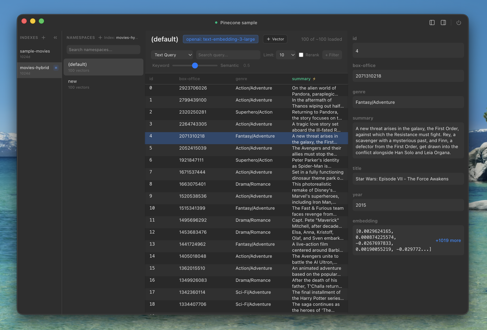

<div align="center">

```
██████╗ ██╗███╗   ██╗███████╗ ██████╗ ██████╗ ███╗   ██╗███████╗
██╔══██╗██║████╗  ██║██╔════╝██╔════╝██╔═══██╗████╗  ██║██╔════╝
██████╔╝██║██╔██╗ ██║█████╗  ██║     ██║   ██║██╔██╗ ██║█████╗
██╔═══╝ ██║██║╚██╗██║██╔══╝  ██║     ██║   ██║██║╚██╗██║██╔══╝
██║     ██║██║ ╚████║███████╗╚██████╗╚██████╔╝██║ ╚████║███████╗
╚═╝     ╚═╝╚═╝  ╚═══╝╚══════╝ ╚═════╝ ╚═════╝ ╚═╝  ╚═══╝╚══════╝

███████╗██╗  ██╗██████╗ ██╗      ██████╗ ██████╗ ███████╗██████╗
██╔════╝╚██╗██╔╝██╔══██╗██║     ██╔═══██╗██╔══██╗██╔════╝██╔══██╗
█████╗   ╚███╔╝ ██████╔╝██║     ██║   ██║██████╔╝█████╗  ██████╔╝
██╔══╝   ██╔██╗ ██╔═══╝ ██║     ██║   ██║██╔══██╗██╔══╝  ██╔══██╗
███████╗██╔╝ ██╗██║     ███████╗╚██████╔╝██║  ██║███████╗██║  ██║
╚══════╝╚═╝  ╚═╝╚═╝     ╚══════╝ ╚═════╝ ╚═╝  ╚═╝╚══════╝╚═╝  ╚═╝
```

A desktop application for exploring and managing Pinecone vector databases. Built with Electron and React.



</div>

## Features

- **Multi-Profile Connections** - Connect to Pinecone indexes with saved profiles
- **Index Management** - Create, configure, and delete indexes with custom settings
- **Record Operations** - Browse, search, create, edit, and delete records with batch support
- **Semantic Search** - Query records using natural language with 13+ embedding providers
- **Metadata Filtering** - Filter records with flexible query syntax
- **Resizable Layout** - Adjustable multi-panel interface with sidebar, table, and detail views

## Supported Embedding Providers

- **Pinecone Inference** - Llama Text Embed v2, Multilingual E5 Large, Sparse English v0
- **OpenAI** - text-embedding-3-small, text-embedding-3-large

## Tech Stack

- **Desktop**: Electron
- **Frontend**: React, TypeScript, Tailwind CSS
- **Data**: TanStack Query, TanStack Table
- **UI**: Radix UI components, Lucide icons
- **Database**: Pinecone SDK

## Project Structure

```
├── electron/           # Main process (IPC handlers, Pinecone service, window management)
├── src/
│   ├── windows/       # Window components (Setup, Connection, Settings)
│   ├── components/    # UI components (indexes, records, modals)
│   ├── context/       # React contexts (Pinecone, Indexes, Records)
│   ├── hooks/         # Custom hooks
│   └── providers/     # Context providers
```

## Development

```bash
# Install dependencies
pnpm install

# Start development server
pnpm dev

# Build for production
pnpm build
```

## Configuration

API keys for embedding providers can be configured in **Settings** (Cmd+,). Keys are stored securely in the system keychain.

## License

MIT
